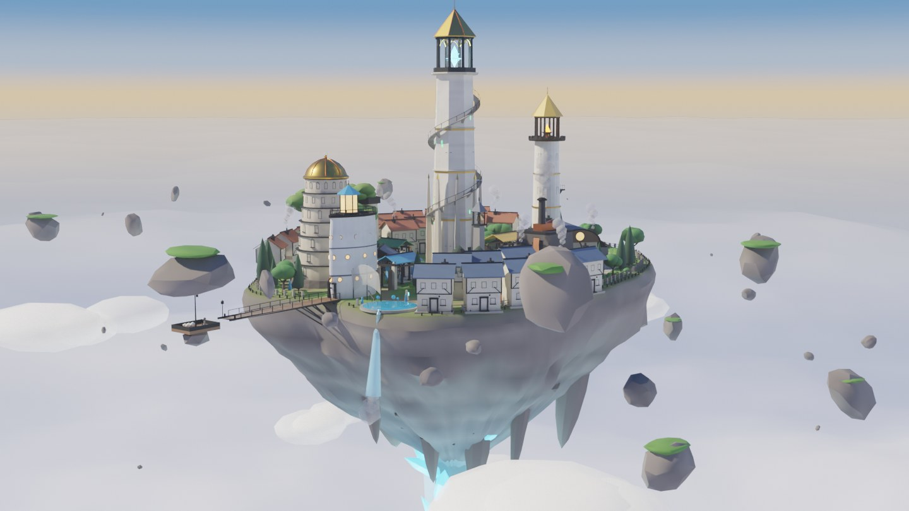

<div align="center">

# ✦ 艾瑟兰 · 三块大陆

**AETHERIA · THREE CONTINENTS, ONE FLOATING ISLE**

一个用代码铸造的剑与魔法三维世界

`Blender 程序化建模` · `glTF / Draco` · `Three.js` · `程序化地形` · `高奇幻设定`



*星槎学院 —— 全部在 Blender 4.2 中由 Python 程序化建模，Cycles 渲染*

</div>

---

## 世界概览

> “当最后一颗星辰坠入大海，所有的光，都在这里醒来。”
> ——《白冠圣典 · 第一卷》

艾瑟兰（Aetheria）是一个高奇幻世界：星辉女神陨落后，她的血与泪化作星辰碎片坠入大海，大地自虚空中隆起。**三块大陆**——主大陆、暮影大陆、铜脊大陆——与东南的**碎浪群岛**，隔着暮影海峡与铜海峡相望。最大的星陨碎片落在主大陆北缘，成为**星辉裂隙**——一切魔法（星辉）的源头、第一大河**星辉河**的源流，以及**星槎空岛**之下那道永不熄灭的光柱。

星辉历 412 年，三块大陆为**十四势力**共有——同一血脉的种族分裂为多个王国，彼此割据、结盟、嵌居；每个王国都是**多城邦的区域**：一座突出的首都，加上若干大城、镇与村，共**四十二座具名城镇**：

| 种族 | 势力 | 领地 |
| --- | --- | --- |
| 人类 | 白冠王国 · 灰港公国 · 晨晖主教区 · 碎浪群岛 | 主大陆中央平原 / 南岸河口 / 熔川下游圣地 / 东南群岛 |
| 精灵 | 银叶王国 · 月影林地 | 熔川下游以东（翡翠林海）/ 熔川上游以西（柳林） |
| 矮人 | 熔心城邦 · 铜脊部族 | 铁砧山脉之心 / **铜脊大陆**崖壁（两山隔海相望） |
| 兽人 | 黑牙战团 · 血誓部族 | 西南风暴荒原 / 西北雾沼边缘 |
| 半身人 | 金麦谷 · 麦浪商盟 | 南部谷地 / 白冠境内飞地 |
| 暮影族 | 暮影领（禁域） | **暮影大陆**（影蚀之夜“自行划走”的独立大陆） |
| （万族） | 星辉教团 · 星槎学院 | 裂隙旁的中立圣地 / 裂隙上空三百丈的空岛 |

四河四湖穿洲而过：**星辉河**自裂隙流出、穿白冠城七丘、在灰港入海；**熔川**分两林而治，川上不许立桥；**夜语溪**出铁砧西麓、没入雾沼；**铜川**汇铜脊五溪、向西南入海。**星落湖**深不见底，湖心比岸上多三颗星的倒影；**镜渊湖**平如明镜，圣骑士照镜验誓；**影湖**立在暮影高原的中央；**净庭湖**是铜脊人的圣水。

裂隙正上方三百丈，悬着一块升空八百年未落的台地——**星槎学院**，万族最高学府：四院（晨辉 / 星语 / 锤音 / 海心）、分选礼、星潮晚宴，六族皆录，只问心焰。

## 功能特性

### 三维世界地图
- 🌍 **三块程序化大陆 + 群岛**：主大陆（扰动椭圆掩膜 + 西部荒原半岛）、暮影大陆（死寂高原 + 亡者山脉）、铜脊大陆（铜脊山脉 + 西原）、碎浪群岛六岛 + 礁岛；fBm + 山脊噪声塑造山脉高原
- 🏞️ **真实水文学**：星辉河 / 熔川 / 铜川沿指定流域蜿蜒入海（河口挖通），夜语溪水力追踪自然成溪、没入雾沼；星落湖 / 镜渊湖 / 影湖 / 净庭湖碗状湖盆
- 🗺️ **十四势力领地**：噪声扰动 Voronoi 疆界覆盖全部大陆，各势力专属地貌配色与植被密度
- 🏰 **四十二座具名城镇**，四级制：首都（各自地标：七塔石桥 / 灯塔栈桥 / 黄金大教堂 / 礁岩要塞 / 千岁梧桐 / 月石环 / 熔心圣炉 / 崖壁双塔 / 雷牙图腾 / 百鼓营 / 圆顶粮仓 / 钟塔集市 / 寂灭黑塔 / 星尖圣殿）+ 大城（小塔信标）+ 镇（本族色小旗）+ 村
- 🏘️ **统一的民族建筑风格**：每种族的城镇共用同一套屋顶形制（人族坡顶 / 精灵尖顶 / 矮平顶石 / 兽人圆帐 / 半身人圆顶 / 暮影尖塔），配色随势力
- 🏫 **星槎空岛**：裂隙正上方的浮空学府——星陨塔、四色院塔与回廊、宿舍环、星穗馆金穹、不落水的浮池、浮岩群；随潮汐轻轻起伏
- 💎 **星辉裂隙**：世界之心——发光晶簇、光柱、旋转星环与上升粒子
- 🌫️ **雾沼**沼泽着色（夜语溪没入之处），暮影晶簇环绕寂灭之塔
- 🌊 动态海面着色器（长周期涌浪）、大陆架渐隐、大气雾效
- 🌗 **黎明 / 正午 / 星夜** 三档氛围平滑切换（夜间信标、晶簇、四院灯火与星辉流显著增亮，星空浮现）
- ✨ 星辉流：从裂隙通往十三座首都的流光航线
- 🖱️ 轨道相机（旋转 / 缩放 / 平移）、自动环绕、点击任一城镇 / 空岛打开志书卡片、图例点击飞赴势力疆域

### 星槎学院（独立专题页 · 真正的 3D 模型）
- **Blender 程序化建模**：整座空岛由 `blender/academy/build.py` 在 Blender 4.2 中用 Python 生成——约 5,000 个部件、17.6 万顶点，全部按设定书（`docs/02-星槎志.md`）落位：
  倒锥岛体与塔根、星陨塔与螺旋外梯、裂隙晶、四柱、四院四塔（晨辉火廊 / 星语观星台与浑仪 / 锤音炉口与誓铁墙 / 海心船形塔与长明灯）、七层星穗馆、校史馆、星潮厅、灶房梯田羊圈、烬园与熄灯钟楼、二十二栋按年份分的宿舍、千岁梧桐、槎埠栈桥、渡船「第二块石头」、浮池与云网、旧阶堆、马圈、三十四块陪岛石、云
- **导出**：合并为 342 个网格，顶点色着色（无贴图），Draco 压缩 glTF 仅 **1.7 MB**；每个可动部件带 `extras`（fx 类型 / 轨道参数 / 志书键），网页据此点火、转晶、涨潮、开船、摆旗
- **网页观览器**（`js/academy3d.js`）：着色器天空与云海、裂隙光柱与上升粒子、晨 / 午 / 夜三档氛围、渡船 90 秒潮汐往返、陪岛石公转、22 处**热点**——悬停高亮、点击飞入并翻开志书卡片、地名浮标自动避让与遮挡剔除、全屏、键盘翻页
- **志书**：船票、槎埠时刻、摆渡人、四院（院长 / 院规 / 塔）、分选记录、星槎七律、十四贡、仪典、建模札记
- 同一个 GLB 也被放进世界地图的裂隙上空（缩放 0.62），点击「星槎学院」即可飞赴
- 八个机位的 Cycles 成图：`models/render_*.png`

### 世界观设定
- 创世神话（星陨创世）
- 纪元年表（星陨纪 → 当前纪 · 十个纪元，含白冠之誓、空岛升腾、暮影分离）
- 地理志（十二景：中央平原 / 四河 / 四湖 / 两大陆 / 碎浪群岛 / 雾沼 / 星槎空岛）
- 星辉魔法体系（六大学派 + 心焰 / 燃烬代价）
- 神器图鉴（七件传世神器，含裂隙晶）
- 名词典（十九个核心词条，含三大陆 / 星槎 / 分选礼 / 两海峡）

### 种族图鉴
- 六大种族卡片：人口、寿命、**诸邦**领地、三维属性条、文化信仰、名士、种族关系网

## 本地运行

无需构建，直接打开或起一个静态服务器：

```bash
# 方式一：直接打开
open index.html          # macOS
start index.html         # Windows
xdg-open index.html      # Linux

# 方式二：静态服务器（推荐）
python3 -m http.server 8080
# 然后访问 http://localhost:8080
```

> Three.js r128、GLTFLoader、DRACOLoader 与 draco 解码器已内置于 `vendor/` 目录，**无需联网、无需 npm 安装**。
> 学院 GLB 通过 `fetch` 载入，因此请用静态服务器（方式二）而不是 `file://` 打开——否则地图上会退回简版空岛。
> 建议桌面端 Chrome / Edge / Firefox 现代版本，带 WebGL 的显卡体验最佳。

## 目录结构

```
aetheria-world/
├── index.html                 # 主页面（四大栏目：地图 / 星槎学院 / 世界观 / 图鉴）
├── css/style.css              # 暗金奇幻风格样式（含学院 3D 舞台 / 志书卡片 / 船票）
├── js/
│   ├── noise.js               # 确定性 value-noise / fBm / 山脊噪声
│   ├── terrain.js             # 地形系统（三大陆掩膜 / 河流水力 / 湖泊 / 42 城选址）
│   ├── data.js                # 世界观数据（势力 / 42 城 / 学院志书 / 地理志 / 纪元 / 魔法 / 神器）
│   ├── world.js               # 3D 世界引擎（领地着色 / 分层城镇 / 裂隙 / 氛围；载入学院 GLB）
│   ├── academy3d.js           # 星槎学院独立观览器（天空 / 云海 / 光柱 / 热点 / 氛围 / 动画）
│   └── app.js                 # 页面交互（标签页 / 卡片 / 学院志书与 3D 舞台 / 图鉴渲染）
├── blender/academy/           # ★ Blender 程序化建模源码（Python，Blender 4.2）
│   ├── build.py               # 入口：建模 → 合并 → 导出 GLB + 热点 JSON → 渲染
│   ├── layout.py              # 总平面：所有建筑的位置 / 朝向 / 尺寸（与设定书一一对应）
│   ├── island.py              # 倒锥岛体、地形高度场、岩柱、晶根、陪岛石、云
│   ├── parts.py               # 建筑零件库：墙体砌缝、门窗、屋顶、栏杆、楼梯、柱廊、灯…
│   ├── buildings_core.py      # 星陨塔 / 四柱 / 广场 / 回廊 / 星穗馆
│   ├── buildings_houses.py    # 四院四塔 / 梧桐 / 栈桥与渡船 / 浮池云网
│   ├── buildings_life.py      # 星潮厅 / 灶房梯田 / 宿舍 / 烬园钟楼 / 马圈 / 植被 / 人物
│   └── util.py                # 网格工具、材质、顶点色、调色板
├── models/
│   ├── xingcha_academy.glb    # Draco 压缩 glTF（1.7 MB）
│   ├── xingcha_academy.hotspots.json   # 22 处热点（名称 / 位置 / 相机机位）
│   ├── xingcha_academy.blend  # Blender 源文件（合并前，可直接打开编辑）
│   └── render_*.png           # Cycles 渲染成图（八个机位）
├── docs/
│   ├── 01-世界志.md            # 世界观设定书（大陆 / 势力 / 时局 / 名词）
│   └── 02-星槎志.md            # 星槎学院设定书（建模与网页文案的唯一依据）
├── img/                       # 学院插图与渲染图
├── vendor/                    # Three.js r128 · OrbitControls · GLTFLoader · DRACOLoader · draco 解码器
├── LICENSE
└── README.md
```

## 重新生成模型

```bash
# 需要 Blender 4.2+（无界面运行）
cd blender/academy
blender -b --python build.py -- --out ../../models            # 建模 + 导出 GLB / 热点
blender -b --python build.py -- --out ../../models --blend    # 另存 .blend
blender -b --python build.py -- --out ../../models --render --quality high   # 加渲染八机位
ACADEMY_VIEWS=hero_sw blender -b --python build.py -- --render --quality preview --no-export  # 只渲一个机位
```

建模约 4 s，合并 + Draco 导出约 40 s；渲染视机器而定（2 核 CPU 上每机位 1–4 分钟）。

## 技术说明

| 模块 | 实现 |
| --- | --- |
| 地形 | 481×481 采样网格（1600 单位世界），三大陆独立掩膜 + 高度函数，扰动海岸 + 山脊山脉 |
| 河流 | 指定流域沿走廊蜿蜒 + 河道幂等雕刻 + 河口挖通；自由溪流用 8 方向最速下降水力追踪；湖盆碗形雕刻 + 环湖抬坝 |
| 势力分布 | 14 中心噪声扰动 Voronoi（top-2 权重边界混合），飞地加权；顶点色 / 植被密度 / 建筑配色同源驱动 |
| 城镇 | 42 城四级制（首都 / 大城 / 镇 / 村），锚点定位 + 局部找平；屋顶形制按种族、配色按势力 |
| 性能 | 树木 / 建筑 / 村庄 `InstancedMesh`（数千实例单次绘制），4096 PCF 软阴影 |
| 氛围 | 天空 / 海面 / 雾 / 光照 / 星空 / 发光体由统一状态机插值切换 |
| 渲染 | sRGB 输出 + ACES 色调映射 |
| 确定性 | 全部噪声与摆放使用固定种子（`srand` 线性同余），每次打开布局一致 |
| 学院建模 | Blender bmesh 程序化：砌缝墙体 / 参数化屋顶 / 螺旋梯 / 树冠簇；全部材质用**顶点色**（无 UV、无贴图），glTF 体积极小 |
| 学院导出 | 按（集合 × 材质 × 动效类型）合并；可动件保留独立对象与 `extras`；Draco 量化（位置 14 bit / 法线 10 bit / 颜色 10 bit） |
| 学院观览 | 单 Draw Call 天空（地平线 / 天顶 / 云海 fbm / 日晕）、加法混合光柱与粒子、`Raycaster` 遮挡剔除的 HTML 地名浮标、双 WebGL 场景按标签页互斥渲染 |

## 创作声明

艾瑟兰是一个**原创**高奇幻世界，其气质与框架受 D&D（龙与地下城）及经典剑与魔法文化启发；所有种族、地名、人物、历史均为虚构创作。

## 许可

[MIT License](./LICENSE) — Three.js 相关代码遵循其自身的 MIT 许可。
